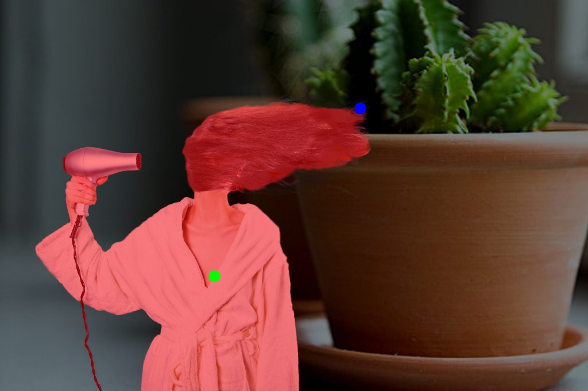

# InteractiveMatting
Interactive Matting proof of concept

<p float="left">
  
</p>

<p float="left">
  
   
</p>

Matting using only user clicks without trimaps
Testing code in ```My test.ipynb```
The model is based on [Deeplabv3](https://pytorch.org/hub/pytorch_vision_deeplabv3_resnet101/) implementation with additional inputs for clicks added from interactive segmentation models. There is also added uncertan blue clickmap for semi-transparent areas.

## Weights
Download pretrained model from [gdrive](https://drive.google.com/file/d/1MiTQ1RG7AClm-4VqASXnYTeOImgOTxGm/view?usp=share_link)

## Run
For testing install all requirments and run sequentially all cells in ```My Test.ipynb```  
For training install all requirements, setup datasets paths and run ```cd training; python train.py```  
According to Adobe license please contact Brian Price (bprice @adobe.com) for the [Composition 1K](https://sites.google.com/view/deepimagematting?pli=1) dataset.  

## References
We are largely benefiting from:  
[1] https://github.com/hkchengrex/MiVOS  
[2] https://github.com/saic-vul/ritm_interactive_segmentation
